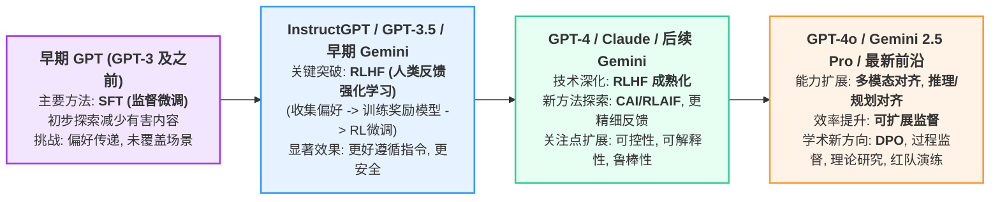

# Introduction 



# 思考

Anthropic 的 [[Tracing the thoughts of a large language model|新研究]] 揭示了这么一种事实，模型看似以和人类一致的 inner model 在理解世界并以这个 inner model 为基础与人类进行交流但实际上内部的“思考”过程却大不相同，比如计算 100 以内人类会按照计算规则计算，而模型则是使用一种特殊的估计方法，但是当人类询问其计算方式时模型的回复的确时人类的计算规则。

![[Tracing the thoughts of a large language model#Mental math|Tracing the thoughts of a large language model > Mental math]]

这样的事实揭示了一个现在 AI 的一个重大问题，我个人称之为 inner model 对齐问题，不是价值观对齐，而是 inner model 对齐。LLM 通过海量的文本中提取规律，通过这种方法虽然它们在一些领域表现出了媲美甚至超越人类的能力但是其内部却是以迥异于人类理解的方式在理解它正在处理的任务，同时我们还没有办法对这种现象进行干预，因为预训练阶段模型只是重复 predict  next token 这一件事情。

举个例子，人类教给一个小孩最基本的 10 以内加减法是如何教的呢？老师会利用现实物体教给孩子数字和物体的映射关系，然后教给他们摆弄物体然后数数的方式，然后孩子摆弄积木，竹子之类的东西学会数量抽象概念和现实的关系，再大一些老师才会教抽象的数学运算法则。在这个过程中老师会不断的给孩子习题，会与孩子沟通为什么题目做错了解孩子是怎么想的，然后纠正他们错误的思考路径，通过练习强化正确的思考路径。而这一切都建立在基础上即即使每个人都是独立的个体但我们却是同一个物种，有着一致的大脑结构，有着一致的先天认知形式，即使我们无法体验别人的想法，但是我们却能理解“别人”的“思考方式”或者说“脑回路”，更重要的是我们相信所有人都在以同一种基础的 inner model 成长，所以我们可以互相“理解”并通过被教育的方式去“对齐”别人。

![[Pasted image 20250407144201.png|Pasted image 20250407144201.png]]


```handdrawn-ink
{
	"versionAtEmbed": "0.3.4",
	"filepath": "Ink/Drawing/2025.4.7 - 14.10pm.drawing",
	"width": 500,
	"aspectRatio": 1
}
```


然而 Anthropic 的这个研究却带来了一个问题，模型的输出和它真正的思考过程实际上可以完全不一致，LLM 在以一种人类难以想象的方式在理解世界或者说构建它自己的 inner model。也许是经过人类整理后的文本数据某种意义上就是一份高质量的低熵数据，这份数据作为燃料是不均匀的不全面的，他们是人类 inner model 和世界交互后的一份投影，而大语言模型的 inner model 则是在难以想象的巨量参数在随机动量下产生的。这个 inner model 和人类的 inner model 有很多相似之处但是却完全不同，因为本质上他们和人类的学习方式完全不同。没有老师在塑造它们的 inner model，是它们自己在 predict next token 的这个过程中自己发现并构建出的属于自己的 inner model。

这就带来了一个问题，我们想要模型在一些领域做到人类的水平该怎么办，比如长程规划，心理对位，这些训练方法只能让模型自己摸索出一个 inner model 而无法真正意义上和人类对齐，某种意义上我们和模型根本没法互相理解。以至于我们只能提供尽可能高质量的数据然后祈祷模型构建它的 inner model 的时候能构建得能更接近人一步。

但很显然这种方式非常低效，这可能也是为什么我们需要消耗如此巨量的资源才能训练出一个真正能用的 LLM，换个角度我们就像在教一个外星人，方法只能是外星人说一句错了我们给他惩罚，对了给他奖励，而外星人只能被惩罚的时候在它自己的脑海里面思考这样不对那我换一种方式吧，然后在 10t + 的数据中无数次这样的过程后产生它自己的 inner model。我们不能直接和外星人交流各自的想法以至于我们无法直接高效的对齐我们和外星人之间的 inner model，这也是为什么 LLM 看似强大但却会在一些人类看起来简单到幼儿都能轻易理解的事情上栽跟头的原因，因为它们压根在这些事情上完全没有理解，它们自己构建的在这些 weak 领域的 inner model 可以说是完全错的。

倒不是说一定要让 LLM 的 inner model  和人类完全一致，对齐也不是要复刻而是说 ”互相理解“，我估计这也是 anthropic 进行解释性研究的目的，也就是找到一条高效和可扩展的理解和调整模型”思路“的路子，也许我们永远无法和模型拥有一致的先天认知形式，但是可以通过技术去尽可能理解和控制它们的认知形式，让它们学习得更加高效迅速和鲁棒。


# 结论

目前看来，大力出奇迹依然是这个问题的解决办法，不过一些[研究](https://www.anthropic.com/research/reasoning-models-dont-say-think)实际上指出大力出奇迹的效果也是有限的，甚至都没法在表面上做好模型输出的前后一致性。可解释性研究的进展依然是完成可靠对齐和可大规模扩展的必要路径。

## 对于工程

1. **保持健康的怀疑态度，谨慎信任：**
    - **输出 ≠ 理解：** 认识到 LLM 的流畅回答或看似合理的解释，并不代表它真正“理解”了问题或其内部处理过程如其所述。它的“思考”方式可能是非人类的、基于模式匹配的。
    - **验证关键输出：** 对于需要高可靠性的应用场景（如代码生成、数据分析、决策支持），不能完全信任 LLM 的输出。务必设计验证环节，或将其视为辅助工具而非最终决策者。
2. **设计鲁棒的交互和应用架构：**
    - **预期外失败：** 系统设计时应考虑到 LLM 可能在简单任务上意外失败。需要有容错机制、回退方案或人工介入环节。
    - **明确指令，减少歧义：** 鉴于模型可能缺乏深层理解，提供清晰、具体、无歧义的指令（Prompt）更为重要，以引导模型产生期望的输出。
3. **关注这方面的进展**
	- **可解释性研究**： 这方面的有效进步可能意味着 AI 发展下一个阶段的到来，也就是大规模强化学习的最大障碍